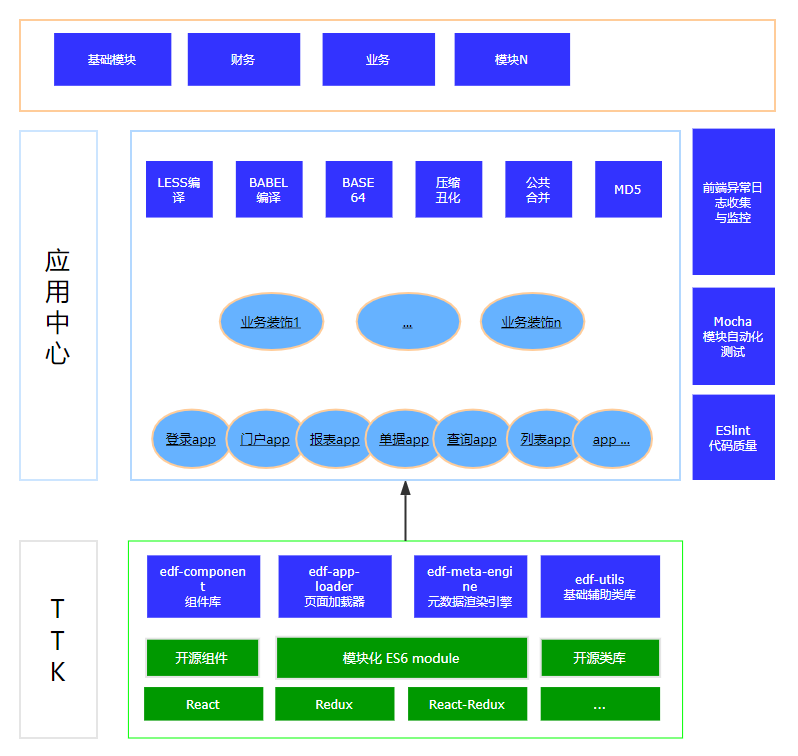

  


  [](https://github.com/thethreekingdoms/ttk-app-core/master/LICENSE)
  [](https://www.npmjs.com/package/ttk-app-core)


  [](https://github.com/thethreekingdoms/ttk-app-core)
  [](https://github.com/thethreekingdoms/ttk-app-core)
  [](https://github.com/thethreekingdoms)

 

  ### ttk-app-core是一套完整的前端工程化解决方案，涵盖项目的起始、开发、测试以及部署阶段。

  ### ttk-app-core包含4个核心模块：   ###

  ``` 1、```

  ``` 2、```

  ``` 3、```

  ``` 4、```


 

  ### 目前ttk-app-core版本为v1.x，构建系统基于[webpack v3](https://webpack.js.org/)。构建产出代码支持IE9及以上版本浏览器。  ###

  ### 命名来源：TTK是三国演义（The Three Kingdoms）的简写,它代表一个团队，ttk-app-core是整个企业开发平台（TTK）中的前端框架部分。  ###
 


